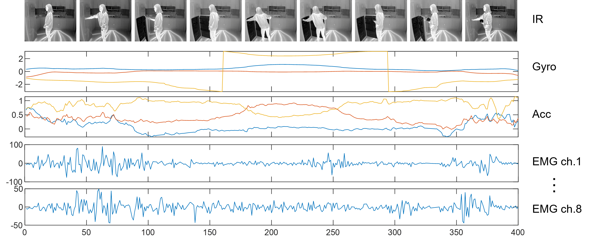

# KETI ACTION DATASET
==============================
    
## Environment
> Living lab
The HDIA dataset is recorded in a real environment house called a living lab to recognize human indoor behaviors from the perspective of a home service robot

     

#### Raw Data

## Action class List 48

* 실제 고령자 행동을 관찰하여 정의한 55종 행동 중 팔을 사용하지 않는 7종 행동을 제외하여 48종 행동 인식에 활용 

### Data file name layout

    A005_P068_G001
    |    |    |
    |    |    └───────────────────  Trial : 횟수 
    |    └────────────────────────  Subject : 피실험자 id
    └─────────────────────────────  Action : 행동 id

### Action Trainning Dataset Link
https://drive.google.com/drive/folders/1VWrVRpRQVgi8zJ-KiLAnfZGGekVRliSu

