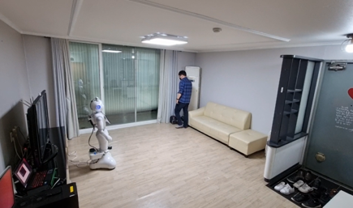
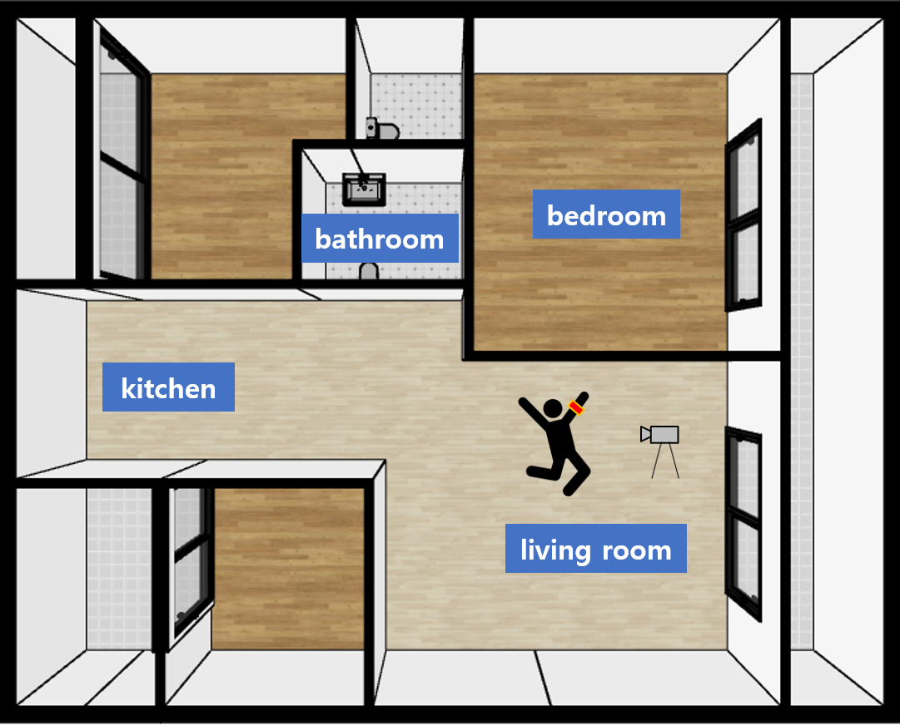
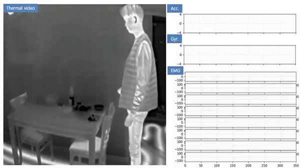
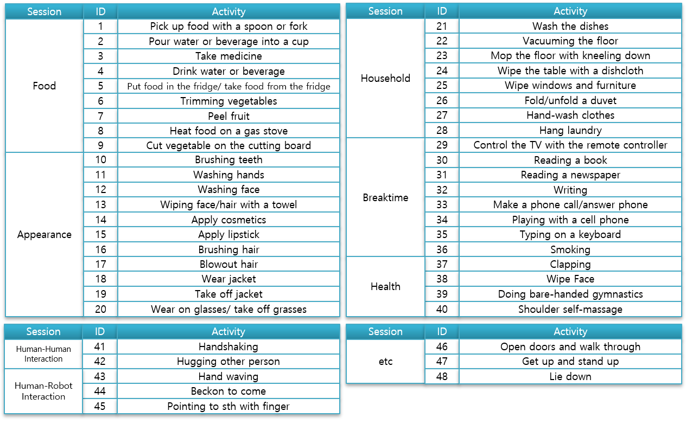
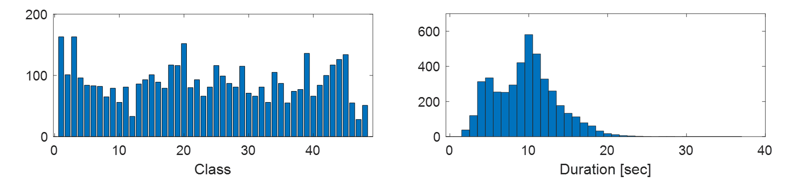

# HDIA 데이터셋
Human Daily Indoor Actions (HDIA) 데이터셋은 실내에서 이루어지는 일상 행동을 담은 데이터셋으로, 가정용 서비스 로봇의 보급을 대비하여 구축된 데이터셋입니다. 로봇과 인간의 원활한 의사소통을 위해 로봇은 사람의 행동을 이해할 수 있는 지능이 요구되며, 이를 위해선 로봇 관점에서 보는 사람의 행동 데이터가 필수적입니다. 본 데이터셋은 로봇의 사람 행동 인식 기술 개발에 주요한 요소를 포함한 데이터를 제공하고 있습니다.

## 수집 환경
> __Living lab__ >
로봇과 사람이 한 집에 공존한다는 가정 아래 아파트에 실제 가정 환경을 모사한 테스트베트 환경을 구축하였습니다. 참가자들은 같은 행동에 대해 장소를 바꿔가며 여러번 촬영했습니다. 참가자들의 자연스러운 행동을 위해 자세나 위치 등에 대해 제약을 최소화하였으며 평소 그들이 행동하는 대로 자유롭게 행동하였습니다. 기존의 Human Action Recognition (HAR) 데이터셋과의 차별점은 가정용 로봇의 시각을 염두에 두었기 때문에 정면, 측면, 후면 등 다양한 뷰에서 촬영했다는 것입니다.

     

## 촬영 기기
> __IR 카메라, MYO 암밴드__ >
HDIA 데이터셋은 실험자들의 개인 정보를 보호를 최우선으로 생각하기 때문에 열화상 카메라(IR camera)와 암밴드(armband) 센서를 사용하였습니다. 열화상 카메라는 직접적인 얼굴 노출이 있는 RGB 카메라 대신 시각 데이터를 모으는 데 사용되었습니다. FLIR Boson 320A50  기기를 페퍼 로봇의 키에 해당하는 120cm 높이에서 촬영하였습니다. 암밴드는 9축 관성 센서와 8개의 전극을 내장한 Thalmic lab의 MYO 기기를 사용하였습니다. 참가자들은 오른쪽 전완근에 암밴드를 착용하였습니다.

## 48종 행동 리스트

note) 실제 고령자 행동을 관찰하여 정의한 55종 행동 중 팔을 사용하지 않는 7종 행동을 제외하여 48종 행동 인식에 활용 
<url = "https://nanum.etri.re.kr/share/dhkim008/robot_environment1?lang=ko_KR">

### Data file name layout

    A005_P068_G001
    |    |    |
    |    |    └────────  Trial : 횟수 
    |    └─────────────  Subject : 피실험자 id
    └──────────────────  Action : 행동 id

### Action Trainning Dataset Link
https://drive.google.com/drive/folders/1VWrVRpRQVgi8zJ-KiLAnfZGGekVRliSu

