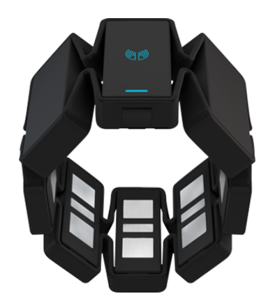
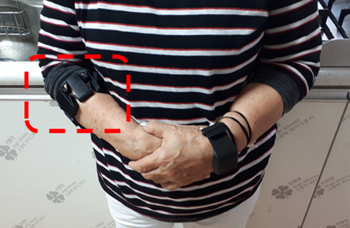
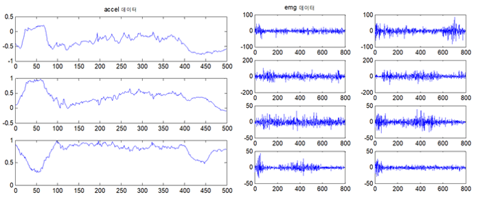
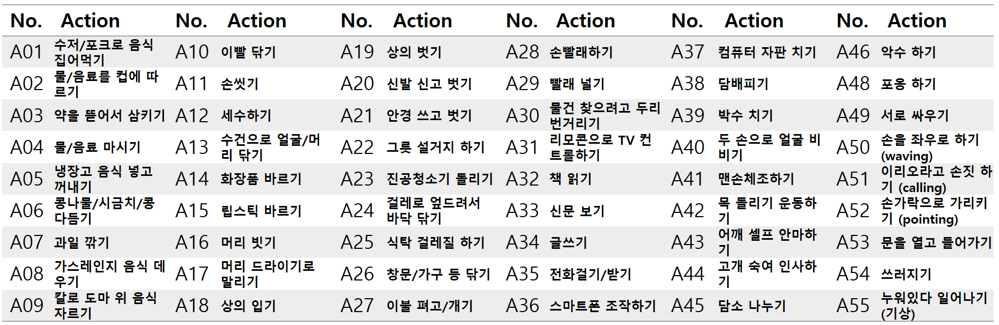

# KETI ACTION DATASET
======================================

> 본 데이터는 Myo Arm band로부터 취득된 IMU/EMG데이터를 55종에 해당하는 행동인식에 적용함.

### A typical top-level directory layout

    .
    ├── doc                     # Documentation files
    ├── image                   # Image files
    ├── LICENSE
    └── README.md
    
### Environment
#### Device
 

> 암 밴드 외형(좌) \ 밴드 착용 사진(우)

#### Raw Data

### Action Type List 55

* 실제 고령자 행동을 관찰하여 정의한 55종 행동 중 팔을 사용하지 않는 7종 행동을 제외하여 48종 행동 인식에 활용 
* 제외 행동 : A20(신발 신고 벗기), A30(물건 찾으려고 두리번거리기), A42(목 돌리기 운동하기), A44(고개 숙여 인사하기), A45(담소 나누기), A48(서로 싸우기), A53(쓰러지기)

### Data set directory layout
    POdd
    ├── accel                  # 가속도(3-axis)  학습 데이터(50Hz)
    ├── emg                    # 근전도(8-ch)    학습 데이터(200Hz)
    └── gyro                   # 각속도(3-axis)  학습 데이터(50Hz)
* 딥러닝 학습에 사용한 데이터 세트로 추후에 추가적으로 데이터 공개 예정

### Data file name layout

    A01_accel_P19_20180802PM123706
    |    |    |        └──────────  Date : 측정 날짜, 오전/오후, 시간
    |    |    └───────────────────  Sbject : 피실험자 번호 
    |    └────────────────────────  Sensor data : accel(3축), gyro(3축), emg(8 채널)
    └─────────────────────────────  Action : 행동 01~55 라벨링

### Action Trainning Dataset Link
https://drive.google.com/file/d/1YhZH-zgQdmXOvFgOP6h79NfzHfG6pxYV/view?usp=sharing

### Link QR Image

